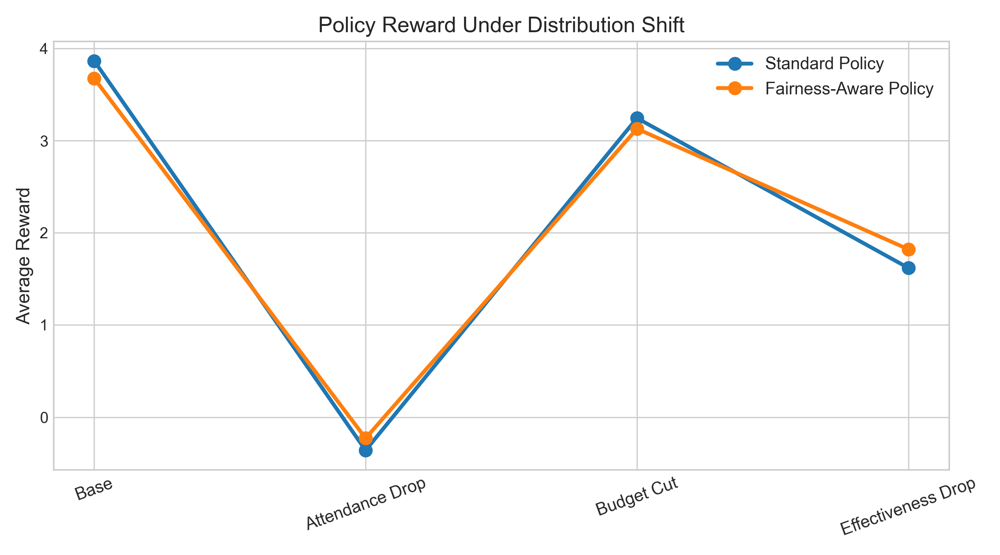
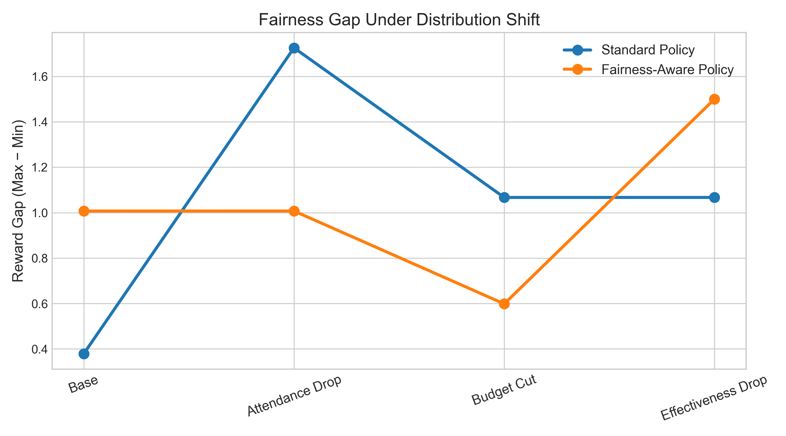

# Fairness-Aware Reinforcement Learning Under Distribution Shift

## Executive Summary

This project investigates the trade-off between efficiency and fairness in reinforcement learning under distribution shift.

Using a synthetic simulation inspired by public healthcare appointment systems, we evaluate how fairness-aware reward regularization impacts performance under operational shocks such as attendance drops, budget cuts, and intervention effectiveness decay.

The results demonstrate that fairness-aware policies can improve robustness and reduce disparity under specific disruption scenarios, but introduce measurable efficiency trade-offs in stable environments.

----------

## 1. Motivation

Real-world resource allocation systems — particularly in public services — operate under:

-   Uncertain user behavior
-   Budget constraints    
-   Socioeconomic disparities   
-   Operational shocks    
-   Non-stationary environment    

Most reinforcement learning systems optimize for efficiency alone. However, in public systems, fairness and equity are critical.

This project explores:

> Can we design RL agents that balance efficiency and fairness under distribution shift?

----------

## 2. Problem Formulation

We simulate a stylized appointment allocation environment where:

-   Patients have heterogeneous behavioral profiles    
-   Attendance is probabilistic    
-   Interventions have costs and varying effectiveness    
-   Budget is limited    
-   Repeated intervention induces fatigue    
-   Socioeconomic groups exhibit different attendance patterns   

The agent must select an intervention for each patient to maximize long-term reward.

----------

## 3. Environment Design

### 3.1 Population

Each patient is characterized by:
-   Age group    
-   Deprivation level (low / medium / high)    
-   Appointment type    
-   Behavioral type    
-   Fatigue level
   
Population size: configurable (default: 20,000 synthetic agents)

----------

### 3.2 Interventions

Available actions:
-   None  
-   SMS    
-   Personalized SMS    
-   Call    
-   Escalation    

Each intervention has:
-   Effectiveness boost    
-   Cost    
-   Daily budget constraint
### 3.3 Attendance Model

Attendance probability is:

`P(attend) = base_behavior + intervention_effect - fatigue` 

Fatigue accumulates when repeated interventions are applied.

----------

## 4. Reinforcement Learning Approach

We implement a Deep Q-Network (DQN) with:
-   Experience replay buffer
-   Target network stabilization    
-   Epsilon-greedy exploration    
-   Multi-episode training
    
Two agents are trained:

1.  **Standard Policy**
    -   Maximizes total reward only.
        
2.  **Fairness-Aware Policy**  
    -   Adds disparity penalty across deprivation groups.
        

----------

## 5. Fairness Metric

We define fairness as disparity across groups:

`Reward Gap =  Max(Group Reward) -  Min(Group Reward)` 

Lower gap indicates more equitable outcomes.

----------

## 6. Distribution Shift Experiments

We evaluate robustness under:

### Base
Nominal operating conditions.

### Attendance Drop
System-wide reduction in attendance probability.

### Budget Cut
Reduced intervention capacity.

### Effectiveness Drop
Intervention effectiveness scaled down.

----------

## 7. Key Findings

-   Standard policy achieves slightly higher base reward.   
-   Fairness-aware policy reduces disparity under attendance shocks.    
-   Under budget cuts, fairness-aware policy improves equity.    
-   Efficiency-fairness trade-offs are scenario-dependent    
-   Fairness regularization does not universally dominate.
    
This highlights the importance of evaluating RL systems under distribution shift rather than only in-distribution performance.

----------

## 8. Results Visualization

Plots generated automatically:
-   Efficiency performance comparison   

-   Equity gap comparison    

Example output:
An interactive Power BI dashboard is included to visualize scenario-level outcomes.

----------

## 9. Installation

Install dependencies:

`pip install -r requirements.txt` 

----------

## 10. Running the Project

Train and evaluate agents:

`python main.py` 

This will:
-   Train both agents
-   Run robustness comparison    
-   Generate plots    
-   Export Excel file for dashboard
- 
Outputs are saved to:
-   `visual/`    
-   `data/`
    

----------

## 11. Technical Contributions

This project demonstrates:
-   Custom RL environment design   
-   Fairness-aware reward shaping    
-   Robustness evaluation under distribution shift   
-   Structured experimental comparison   
-   Dashboard-based analytical reporting
    
----------

## 12. Limitations

-   Synthetic environment (no real-world dataset)    
-   Simplified attendance model    
-   Fairness defined via reward disparity only    
-   No causal inference modeling
   
----------

## 13. Future Work

-   Multi-objective RL   
-   Constrained RL optimization    
-   Causal modeling of attendance   
-   Real-world healthcare dataset validation    
-   Distributionally robust RL approaches
    
----------

## 14. Disclaimer

This project uses synthetic data for research and demonstration purposes only. It does not represent real patient data or official healthcare modeling.
